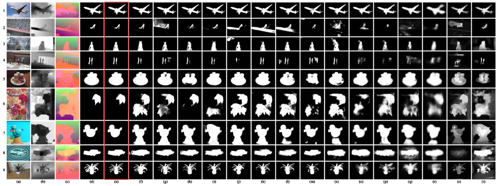

# DSNet

## Dynamic Selective Network for RGB-D Salient Object Detection

This repo is an official implementation of the *DSNet*, which has been accepted in the journal *IEEE Transactions on Image Processing, 2021*.





## Prerequisites

- python=3.x
- pytorch=1.0.0+
- torchvision
- numpy
- opencv-python


## Usage

### 1. Clone the repository

```
git clone https://github.com/Brook-Wen/DSNet.git
cd DSNet/
```

### 2. Training

```
python main.py --gpu '0' --lr 1e-5 --batch_size 4
```
- Training set: NJU2K (1,485), NLPR (700).
- Make sure that the GPU memory is enough.

### 3. Testing

```
python main.py --gpu '0' --batch_size 1 --mode='test' --model='[YOUR PATH]' --test_fold='[SAVE PATH]' --sal_mode='[DATASET]'
```

- We provide the pre-trained [model](https://pan.baidu.com/s/1_zy2iYWSEnPXSAzDQtnZdw) (fetch code: ve9d). 
- We evaluate our DSNet on eight commonly used datasets: NJU2K, NLPR, STERE, DES, LFSD, SSD, SIP and ReDWeb-S. These datasets can be downloaded from the links provided in http://dpfan.net/d3netbenchmark/.

### 4. Evaluation

- We provide [saliency maps](https://pan.baidu.com/s/1HMkbTriDlcfAxCcZqsVZ2w) (fetch code: nd4m) of our DSNet on 8 datasets.
- You can use this [toolbox](https://github.com/jiwei0921/Saliency-Evaluation-Toolbox) for evaluation.


## Citation

### If you think this work is helpful, please cite
```
@inproceedings{wen2021dsnet,
  title={Dynamic Selective Network for RGB-D Salient Object Detection},
  author={Wen, Hongfa and Yan, Chenggang and Zhou, Xiaofei and Cong, Runmin and Sun, Yaoqi and Zheng, Bolun and Zhang, Jiyong and Bao, Yongjun and Ding, Guiguang},
  booktitle={IEEE Transactions on Image Processing},
  year={2021}
}
```

- If you have any questions, feel free to contact me via: `hf_wen(at)outlook.com`.
